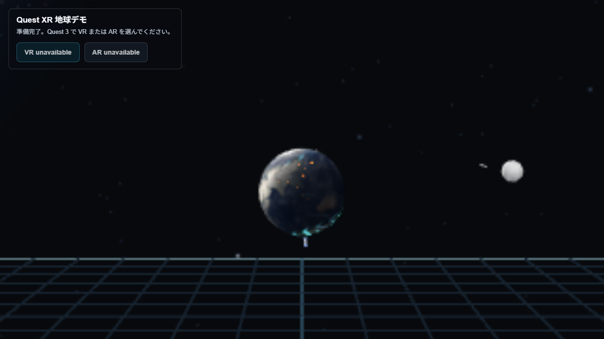
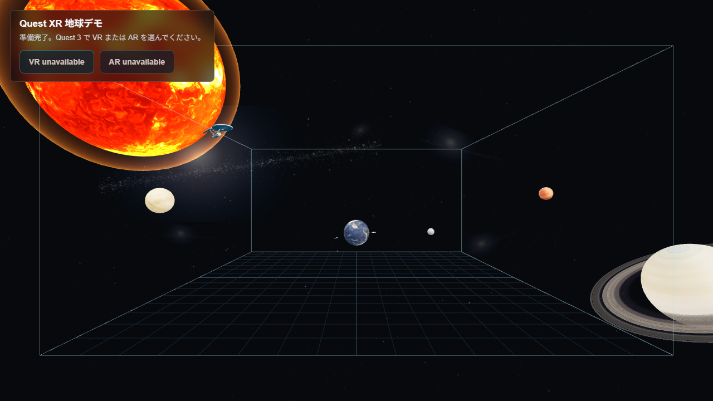
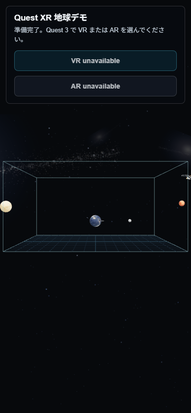
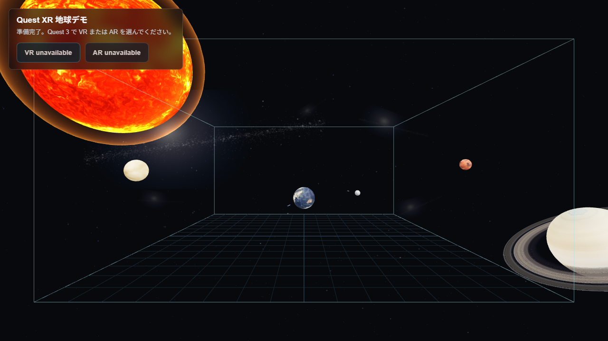

# Quest XR 地球デモ

Meta Quest 3 の VR / AR と、PC ブラウザの3Dプレビューで動く Three.js + WebXR デモです。
宇宙空間に浮かぶワイヤーフレームの部屋を舞台に、地球をコントローラーやキーボードで弾きながら、月、惑星、太陽フレア、インターステラー風ブラックホール、Apollo 11風ミッション、USS Enterprise風のワープ演出、クリンゴン船のクローク解除風通過演出、小さな隕石、人工衛星、旅客機、彗星、夜景、オーロラ、稲光などを眺められます。

公開URL:

https://matzoka.github.io/quest-xr-glass-demo/

直接アプリを開く場合:

https://matzoka.github.io/quest-xr-glass-demo/quest-mr/

## Screenshots

以下は現在のアプリから撮影した実際のスクリーンショットです。PCプレビューで撮影しているため、デスクトップブラウザではWebXRボタンが `unavailable` と表示されますが、Quest BrowserでHTTPS URLを開くとVR / ARセッションを開始できます。










## What You Can See

### 地球と部屋

- 地球はNASA Blue Marble系の地表テクスチャを使った球体です。
- 雲レイヤーは地表と別の速度でゆっくり流れます。
- 地球の自転軸は約23.4度傾けています。
- 可視の太陽位置から昼夜境界を毎フレーム計算し、夜側だけを暗くします。
- 主要都市の緯度経度リストから小さな暖色マーカーを生成し、夜側に入った都市だけ弱く点灯します。
- 海上や山岳へランダムに光を散らさず、点灯位置を都市マーカーに限定しています。
- 極地には、同じ夜側判定で昼側に出ないオーロラがゆらぎます。
- 地球はワイヤーフレームの部屋の中を直線移動し、壁・床・天井で反射します。
- 部屋は宇宙空間に浮いているように見える、シアン系の枠と床グリッドで構成しています。

### 星空と銀河

- 背景には、遠景の星粒を多数配置しています。
- 星は距離レイヤーごとに明るさと大きさを少し変え、奥行きが出るようにしています。
- 大きな銀河帯に加えて、遠方の薄い小銀河を複数配置しています。
- ごく薄い星雲レイヤーを追加し、位置は固定したまま透明度だけをわずかに揺らして、静止画のように見えすぎないようにしています。
- 銀河はカメラに追従するSpriteではなく、遠方に固定した平面メッシュとして描画しています。
- VR / PCプレビューでは宇宙背景を表示し、ARでは現実背景を邪魔しないよう非表示にします。

### 太陽・惑星・月

- 巨大な太陽を左上奥に配置し、シェーダーで表面がゆらぐようにしています。
- 太陽の見える縁のいろいろな位置から、数秒だけ大きさや太さの違うプロミネンス風プラズマアークとフレア光が立ち上がります。
- ごくまれに太陽表面へ黒点群が現れ、太陽の自転に合わせて移動しながら一定時間後に消えます。
- 土星はリング付きで表示し、半径方向だけの高解像度CanvasTextureで濃淡と隙間をはっきり見せています。リングにも太陽方向の明暗と土星本体の影を反映します。周囲にはタイタン、レア、ディオネ、エンケラドゥス風の小衛星が公転します。
- 木星、火星、金星も背景側に配置しています。
- 木星の周囲には、イオ、エウロパ、ガニメデ、カリスト風の小さなガリレオ衛星が公転します。
- 木星・土星の衛星群には、NASA / USGS / JPL由来の全球モザイク画像を1024pxテクスチャとして割り当て、太陽方向に合わせた昼夜の陰影も出しています。
- 太陽以外の惑星は可視の太陽位置から光の向きを計算し、土星・木星・火星・金星にも昼夜の陰影が出るようにしています。
- 火星は地形の濃淡、金星は雲に覆われた柔らかい陰影が出るようにしています。
- 月は地球の約0.273倍の半径で、実物に近いサイズ比を保っています。
- 月面は可視の太陽位置から光の向きを毎フレーム計算し、陰影とクレーターの濃淡を少し強めています。
- 地球と月の距離は、部屋サイズで見やすいように圧縮しています。

### ブラックホール

- 遠方に、インターステラー風のリアル寄りブラックホールを常設しています。
- 黒い事象の地平面、明るい降着円盤、上下に回り込む疑似重力レンズ光、円盤を流れる粒子を重ねています。
- Questで近づくと、中心付近で短い落下演出に入り、星が伸びるトンネル風の視界を通って安全な観測位置へ戻ります。
- `quest-mr/assets/blackhole.mp3` をループ再生し、ブラックホールへ近づくほど音量が徐々に大きくなります。接近時は低音フィルターも少し開き、圧力が増すようにしています。
- Enterprise風宇宙船とクリンゴン船の航路計算では、ブラックホールも障害物として扱い、中心を突っ切らないようにしています。

### 人工衛星と旅客機

- ISS風の人工衛星が地球の周囲を傾いた軌道で周回し、夜側では太陽光が当たらないよう暗くなります。
- 小さなJAL風旅客機が、東京とロサンゼルスを結ぶ大圏ルートに沿って地表近くを飛びます。

### 小さな隕石

- 小型の隕石イベントは、ほとんどが地表に届かず大気圏で燃え尽きます。
- 夜側で燃え尽きる隕石は、地表に近い浅い角度で流れる流れ星として光ります。
- 航跡は実際の進行方向の真後ろへ伸びるよう、ベクトルで明示的に合わせています。
- 巨大隕石には見えないよう、隕石本体、航跡、衝突フラッシュは小さめに調整しています。
- 低確率で地表に到達する場合だけ、従来どおり小さな光のフラッシュが発生します。

### 彗星

- 遠方の宇宙背景を、長い尾を引く彗星が数分単位でゆっくり横切ります。
- 地球へ向かわず、太陽を片方の焦点にした超長楕円軌道で大きく回り込みます。
- 彗星の尾は進行方向ではなく、太陽と反対方向へ伸びます。
- 太陽に近づくほど尾が少し明るく長くなり、遠ざかると薄くなります。
- 初回は確認しやすいよう比較的早めに登場し、その後は長めの間隔で再登場します。

### 地表の稲光

- 地球表面のランダムな地点で短い稲光が発生します。
- 稲光は地球の子要素として配置しているため、地球の自転に追従します。

### Apollo 11風ミッション

Apollo 11そのものの精密シミュレーションではなく、Questの小さな空間で見えるように時間と距離を圧縮した演出です。

- Saturn V風ロケットが地球付近から打ち上がります。
- 第1段、第2段の切り離しを行います。
- CSM（母艦）とLM（着陸船）が接続した状態で月へ向かいます。
- 月付近で軌道投入風の姿勢変更を行います。
- LMが分離し、月面へ降下します。
- 着陸後、月面に着陸船とアメリカ国旗が表示されます。
- 地球・月間の距離は演出用に圧縮していますが、月の大きさ比やApolloの流れは自然に見えるよう調整しています。

### USS Enterprise風の宇宙船

- フリーのOBJ / MTLモデルとテクスチャを読み込んで表示します。
- モデルの材質を調整し、暗く潰れた面が出にくいようにしています。
- 登場時には音声が鳴ります。`quest-mr/assets/enterprise_theme.mp3` があればそれを使い、無ければ合成ファンファーレへフォールバックします。
- 地球の部屋枠を通過してから約10秒後、何もない宇宙空間へ向けてワープを開始します。
- ワープ中は船体と航跡が一体で前進します。
- ワープ音 `quest-mr/assets/warp.mp3` の終了タイミングに合わせて、船体・航跡・スパークが同時に消えます。
- 消滅地点には前方スパークが表示され、船体の最後尾がスパーク内に収まった瞬間に全体が消えるようにしています。
- ワープ速度は視線で追いやすいように抑え、通常航行より遅くならない範囲で調整しています。
- 低確率のレア演出では、別角度から低速接近し、地球近くを約5周してから、地球の部屋枠を抜けるまで通常航行で離脱し、その後は通常と同じ長い航跡のワープで去ります。
- レア演出の周回中だけ `quest-mr/assets/star-trek-viewer.mp3` を流し、周回軌道に入った瞬間に開始して、周回を離れる瞬間に停止します。

### クリンゴン船

- 現在は `quest-mr/assets/klingon_ship/` の `klingon_ship.obj` / `klingon_ship.mtl` を読み込むクリンゴン船モデルを使っています。
- アプリ内の演出名は、特定の艦級名ではなく汎用的に「クリンゴン船」としています。
- ごくまれに、地球の奥側を低速で威圧的に横切ります。
- 出現時は薄い緑のクローク解除風フェードインで現れます。
- 船体の赤・黄・白・緑系ライト材質は、暗い宇宙でも見えるよう弱く発光します。
- 通過の最後は緑のフラッシュとクローク風フェードアウトで消えます。
- Enterprise風宇宙船とは同時に出現しないよう排他制御しています。
- 通過中は `quest-mr/assets/klingon_theme.mp3` を再生し、音声を読み込めた場合は実際の長さに合わせて通過時間を調整します。読み込めない場合は約29秒のフォールバック尺で動きます。
- 出現時は `quest-mr/assets/star-trek-tng-transporter.mp3`、消滅時は `quest-mr/assets/star-trek-transportation.mp3` を効果音として使います。

### 音声

- 地球の衝突音
- Enterprise風宇宙船の登場音
- Enterprise風宇宙船のレア周回中BGM
- Enterprise風宇宙船のワープ音
- クリンゴン船の通過中BGM
- クリンゴン船の出現 / 消滅効果音
- ブラックホール接近時のループ低音

ブラウザの自動再生制限があるため、音声は最初のクリックやQuestコントローラー操作後に有効になります。

## Controls

### Quest VR / AR

- `Enter VR` または `Enter AR`: セッション開始
- コントローラーを地球に近づけて触れる: 地球をその方向へ弾く
- トリガー: 視線 / コントローラー方向へ地球を発射
- 左スティック: 水平移動
- 右スティック上下: 昇降
- グリップ / squeeze: ホーム位置へ戻る
- 目の前の `終了 / Exit` ボタンを指してトリガー: VR / AR終了
- `リセット / Reset`: 地球を初期位置へ戻す
- `Enterprise 周回`: Enterprise風宇宙船の地球周回レア演出を手動で開始 / 予約
- `クリンゴン登場`: クリンゴン船の通過演出を手動で開始 / 予約

### 診断用視線記録

- 黒い影など、Questで見た視線をPC側で再現したい場合は、URL末尾に `?poseDebug` を付けて起動します。
- XR内の `視線記録` ボタンは視界の少し右下に追従します。押すと、その瞬間の頭位置と視線方向から `?cameraDebug...` の再現URLを生成します。
- VR中にHUDが見えない場合は、記録後にVRを終了するとHUDのテキスト欄に再現URLが残ります。
- そのURLをPCブラウザで開くと、同じ視線に近いカメラ位置でスクリーンショット確認できます。

### PC Preview

デスクトップブラウザではWebXRセッションは使えませんが、通常の3Dプレビューとして動作確認できます。

- `W` / `A` / `S` / `D` または矢印キー: 視点基準で地球を弾く
- `E` または `Space`: 上方向へ弾く
- `Q`: 下方向へ弾く
- クリック: 視線方向へ発射
- 左上HUDの `Enterprise 周回`: Enterprise風宇宙船の地球周回レア演出を手動で開始 / 予約
- 左上HUDの `クリンゴン登場`: クリンゴン船の通過演出を手動で開始 / 予約

## Project Structure

- `index.html`: GitHub Pages用の入口。`quest-mr/` へリダイレクトします。
- `quest-mr/index.html`: アプリ本体のHTML。
- `quest-mr/app.js`: Three.jsシーン、WebXR、入力、宇宙演出、Apollo風ミッション、Enterprise風ワープ演出、クリンゴン船演出、太陽・惑星・月の陰影制御の本体。
- `quest-mr/styles.css`: HUDとボタンのスタイル。
- `quest-mr/assets/`: 地球、月、惑星、Enterpriseモデル、クリンゴン船モデル、音声などのアセット。
- `quest-mr/inspect.html` / `quest-mr/inspect.js`: 現行クリンゴン船モデルを単体確認するための検査ビュー。
- `quest-mr/_headers`: 静的ホスト用のMIME設定とCOOP / COEPヘッダー設定。
- `docs/images/`: README掲載用スクリーンショット。
- `scripts/`: 初期のBlender生成スクリプト。現在の地球デモ本体では使用していません。

## Local Preview

任意の静的HTTPサーバーで `quest-mr` を配信します。

```bash
npx http-server quest-mr -p 4321 -c-1
```

ブラウザで以下を開きます。

```text
http://localhost:4321
```

Pythonだけで確認する場合:

```bash
cd quest-mr
python -m http.server 4321
```

## Quest実機で見る

QuestのVR / ARセッションはHTTPSが必須です。GitHub Pages、Netlify、Cloudflare Pagesなど、HTTPS対応の静的ホストで公開してください。

このリポジトリはGitHub Pagesでそのまま公開できます。

1. GitHubの `Settings -> Pages` を開きます。
2. `Build and deployment` の `Source` を `Deploy from a branch` にします。
3. Branchを `master`、フォルダを `/ (root)` に設定します。
4. 数分待つと以下で公開されます。

```text
https://matzoka.github.io/quest-xr-glass-demo/
```

Quest Browserで上記URLを開き、`Enter VR` または `Enter AR` を押します。

## Implementation Notes

- Three.js `0.165.0` をCDN import mapで読み込みます。
- WebXRはブラウザの `navigator.xr` を使い、VR / ARのサポート有無を起動時に確認します。
- 地球の移動は物理エンジンではなく、直線移動と部屋境界での反射で軽量に実装しています。
- 地球の夜側影、主要都市ライト、オーロラはシェーダーで重ね、可視の太陽メッシュ位置を毎フレーム地球ローカル座標へ変換して昼夜を判定しています。
- 月・火星・金星・木星・土星本体は、可視の太陽メッシュ位置を各天体のローカル座標へ変換し、共通の太陽方向シェーダーで昼夜の陰影を出しています。
- 土星リングは角度方向の模様を持たない半径方向だけのCanvasTextureとして生成し、近づいたときのタイル状の継ぎ目を避けています。シェーダーで太陽方向の明暗と土星本体の影を計算します。
- 木星と土星の衛星群は、親惑星グループの周囲に小さな球体とごく薄い軌道線を配置し、NASA / USGS / JPL由来の全球モザイク画像を貼ったうえで毎フレーム公転・自転させています。衛星ごとに可視の太陽位置をローカル座標へ変換し、昼側と夜側の陰影も更新しています。
- 月と火星はテクスチャの局所輝度差からクレーターや地形の濃淡を少し強調し、金星は雲に覆われた惑星らしく柔らかい陰影にしています。
- 都市ライトは主要都市の緯度経度リストから `CanvasTexture` として生成し、手作業のランダム散布や海上の広域発光を避けています。
- 遠景星空はCanvasTextureとPointsで生成しています。
- 銀河は固定平面メッシュとして配置し、Questの頭の動きへ追従しないようにしています。
- ブラックホールはシェーダーで降着円盤と重力レンズ風の光を生成し、近接時はXRの参照空間を安全にオフセットして短い落下体験を作ります。演出終了後はホーム位置へ復帰します。
- 太陽フレアと黒点は太陽メッシュの子要素として生成し、太陽の自転に追従します。フレアはTubeGeometryと加算合成シェーダーで数秒だけ発光し、黒点は暗い半影付きの表面オーバーレイとして一定時間後に消えます。
- 人工衛星の昼夜は、太陽方向と衛星の地球中心からの方向を比較し、夜側では本体色とパネル発光を落としています。
- 彗星は地球へ向かう軌道ではなく、可視の太陽位置を焦点にした超長楕円軌道として生成しています。尾の向きは毎フレーム太陽と反対方向へ更新します。
- EnterpriseモデルはOBJ / MTLを読み込み、読み込み後に中心合わせ、スケール調整、材質補正を行います。
- Enterpriseワープ演出は、音声の長さ、船体位置、航跡、終点スパークを同じ時間軸で同期させています。
- Enterpriseのレア演出は通常ルートとは別の状態として管理し、地球中心を追従しながら近距離を5周した後、地球の部屋枠外まで離脱してから通常ワープへ遷移します。
- Enterpriseのレア周回BGMは、接近中やワープ中には鳴らさず、周回フェーズの開始・終了に合わせてWeb Audioで明示的に開始 / 停止します。
- クリンゴン船モデルは `quest-mr/assets/klingon_ship/` のOBJ / MTLを初回登場直前まで遅延ロードし、フェード中だけ材質の透明度を操作します。Enterpriseと同時に出ないよう、双方の出現スケジュールで排他制御しています。
- Apollo風ミッションは見やすさ優先の圧縮スケールで、打ち上げから月面着陸までをループ再生します。

## Main Tuning Points

主な見た目や動きは `quest-mr/app.js` の定数で調整できます。

- `roomCenter` / `roomHalf`: ワイヤーフレーム部屋の位置とサイズ。
- `EARTH_RADIUS`: 地球の表示サイズ。
- `EARTH_SPIN` / `CLOUD_SPIN`: 地球本体と雲レイヤーの自転速度。
- `CRUISE_DEFAULT` / `MIN_KICK` / `MAX_KICK` / `HAND_GAIN`: 地球を弾く速度と手の入力感度。

## Assets and Rights

このデモにはNASA由来・three.jsサンプル由来の惑星テクスチャ、フリーのEnterprise風3Dモデル、現行のクリンゴン船OBJ / MTLモデル、ローカル音声ファイルを含みます。再配布や公開利用の際は、各素材のライセンスと権利関係を確認してください。

`quest-mr/assets/enterprise_theme.mp3`、`quest-mr/assets/star-trek-viewer.mp3`、`quest-mr/assets/warp.mp3`、`quest-mr/assets/klingon_theme.mp3`、`quest-mr/assets/star-trek-tng-transporter.mp3`、`quest-mr/assets/star-trek-transportation.mp3` を差し替える場合も、利用する音源の権利確認は利用者側で行ってください。
