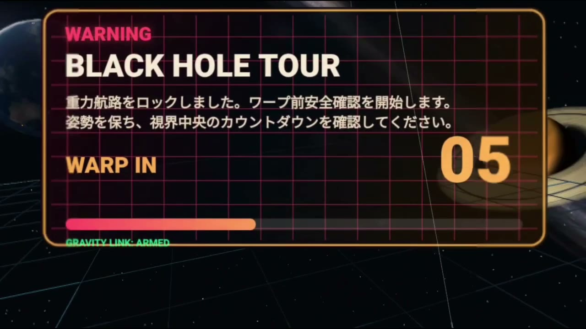
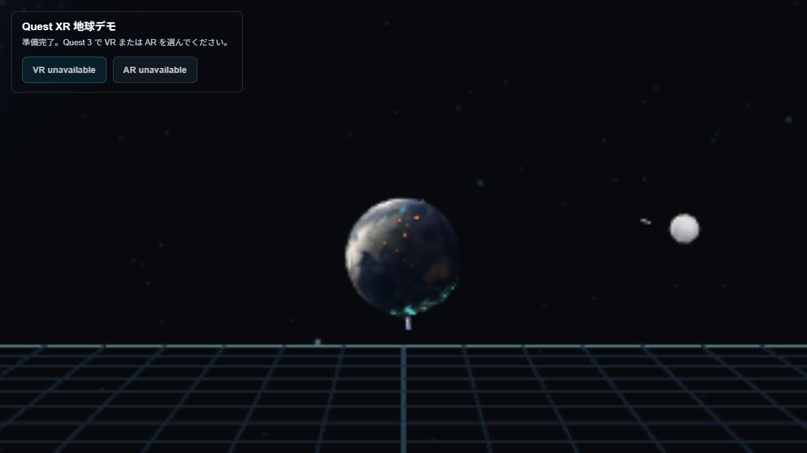
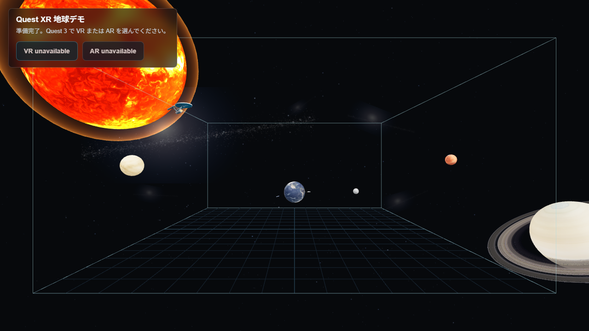
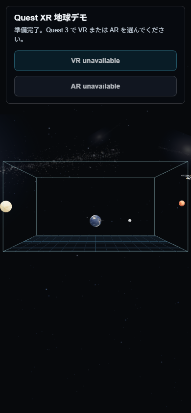
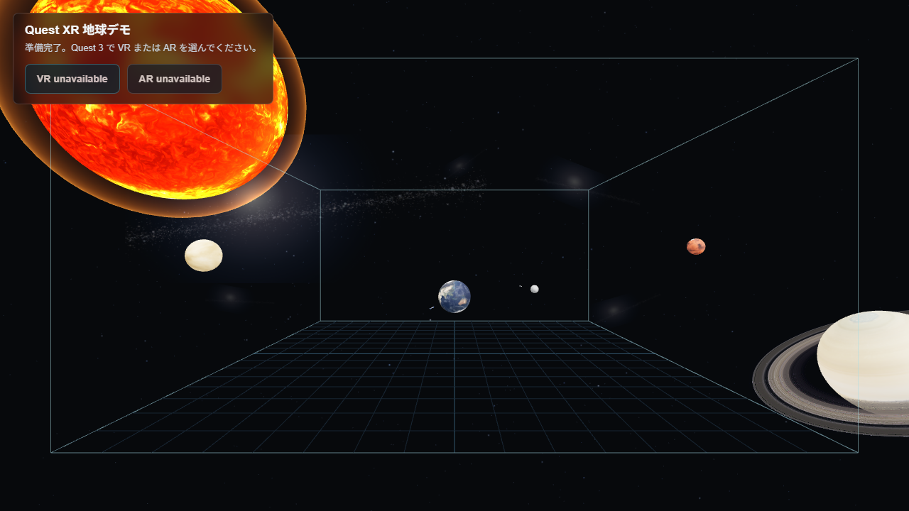

# Quest XR 地球デモ

Meta Quest 3 の VR / AR と、PC ブラウザの3Dプレビューで動く Three.js + WebXR デモです。
宇宙空間に浮かぶワイヤーフレームの部屋を舞台に、地球をコントローラーやキーボードで弾きながら、月、惑星、太陽フレア、インターステラー風ブラックホール、Apollo 11風ミッション、USS Enterprise風のワープ演出、クリンゴン船のクローク解除風通過演出、小さな隕石、人工衛星、旅客機、彗星、夜景、オーロラ、稲光などを眺められます。

自分の環境で動かす手順は「Local Preview」と「Cloudflare Workersデプロイ」を参照してください。

## Reference Video

Meta Quest 3 の VR で動かしたときの参考動画です。宇宙空間、操作パネル、ブラックホール探訪、惑星・宇宙船演出の雰囲気を確認できます。

[](https://github.com/matzoka/quest-xr-glass-demo/releases/download/my-earth-vr-reference-2026-06-19/MyEarth.mp4)

[動画ファイル（GitHub Releases）を開く](https://github.com/matzoka/quest-xr-glass-demo/releases/download/my-earth-vr-reference-2026-06-19/MyEarth.mp4)

アプリと同じサイト上の動画プレイヤーページは `public/quest-mr/myearth-video.html`（デプロイ後は `/quest-mr/myearth-video.html`）です。

## Screenshots

以下は現在のアプリから撮影した実際のスクリーンショットです。PCプレビューで撮影しているため、デスクトップブラウザではWebXRボタンが `unavailable` と表示されますが、Quest BrowserでHTTPS URLを開くとVR / ARセッションを開始できます。










## What You Can See

### 地球と部屋

- 地球はNASA Blue Marble系の地表テクスチャを使った球体です。
- 雲レイヤーは地表と別の速度でゆっくり流れます。
- 地球の自転軸は約23.4度傾けています。
- 可視の太陽位置から昼夜境界を毎フレーム計算し、夜側だけを暗くします。
- 主要都市の緯度経度リストから小さな暖色マーカーを生成し、夜側に入った都市だけ弱く点灯します。
- 海上や山岳へランダムに光を散らさず、点灯位置を都市マーカーに限定しています。
- 極地には、同じ夜側判定で昼側に出ないオーロラがゆらぎます。
- 地球はワイヤーフレームの部屋の中を直線移動し、壁・床・天井で反射します。
- 部屋は宇宙空間に浮いているように見える、シアン系の枠と床グリッドで構成しています。

### 星空と銀河

- 背景には、遠景の星粒を多数配置しています。
- 星は距離レイヤーごとに明るさと大きさを少し変え、奥行きが出るようにしています。
- 大きな銀河帯に加えて、遠方の薄い小銀河を複数配置しています。
- ごく薄い星雲レイヤーを追加し、位置は固定したまま透明度だけをわずかに揺らして、静止画のように見えすぎないようにしています。
- 銀河はカメラに追従するSpriteではなく、遠方に固定した平面メッシュとして描画しています。
- VR / PCプレビューでは宇宙背景を表示し、ARでは現実背景を邪魔しないよう非表示にします。

### 太陽・惑星・月

- 巨大な太陽を左上奥に配置し、Questでも滑らかに動きやすい軽量シェーダーで表面のメラメラした流体感を出しています。太陽本体の外側には赤橙の熱グラデーションと近接熱層を重ね、表面へ近づく前から熱で焼かれそうなにじみを出しています。
- 太陽の見える縁のいろいろな位置から、数秒だけ大きさや太さの違うプロミネンス風プラズマアークとフレア光が立ち上がります。
- ごくまれに太陽表面へ黒点群が現れ、太陽の自転に合わせて移動しながら一定時間後に消えます。
- 土星はリング付きで表示し、半径方向だけの高解像度CanvasTextureで濃淡と隙間をはっきり見せています。リングにも太陽方向の明暗と土星本体の影を反映します。周囲にはタイタン、レア、ディオネ、エンケラドゥス風の小衛星が公転します。
- 木星、火星、金星も背景側に配置しています。
- 木星の周囲には、イオ、エウロパ、ガニメデ、カリスト風の小さなガリレオ衛星が公転します。
- 木星・土星の衛星群には、NASA / USGS / JPL由来の全球モザイク画像を1024pxテクスチャとして割り当て、太陽方向に合わせた昼夜の陰影も出しています。
- 太陽以外の惑星は可視の太陽位置から光の向きを計算し、土星・木星・火星・金星にも昼夜の陰影が出るようにしています。
- 火星は地形の濃淡、金星は雲に覆われた柔らかい陰影が出るようにしています。
- 月は地球の約0.273倍の半径で、実物に近いサイズ比を保っています。
- 月面は可視の太陽位置から光の向きを毎フレーム計算し、陰影とクレーターの濃淡を少し強めています。
- 地球と月の距離は、部屋サイズで見やすいように圧縮しています。

### ブラックホール

- 遠方に、インターステラー風のリアル寄りブラックホールを常設しています。
- 黒い事象の地平面、明るい降着円盤、上下に回り込む疑似重力レンズ光、円盤を流れる粒子を重ねています。
- Questで近づくと、中心付近で短い落下演出に入り、星が伸びるトンネル風の視界を通って安全な観測位置へ戻ります。
- `public/quest-mr/assets/blackhole.mp3` をループ再生し、ブラックホールへ近づくほど音量が徐々に大きくなります。接近時は低音フィルターも少し開き、圧力が増すようにしています。
- Enterprise風宇宙船とクリンゴン船の航路計算では、ブラックホールも障害物として扱い、中心を突っ切らないようにしています。

### 人工衛星と旅客機

- ISS風の人工衛星が地球の周囲を傾いた軌道で周回し、夜側では太陽光が当たらないよう暗くなります。
- 小さなJAL風旅客機が、東京とロサンゼルスを結ぶ大圏ルートに沿って地表近くを飛びます。

### 小さな隕石

- 小型の隕石イベントは、ほとんどが地表に届かず大気圏で燃え尽きます。
- 夜側で燃え尽きる隕石は、地表に近い浅い角度で流れる流れ星として光ります。
- 航跡は実際の進行方向の真後ろへ伸びるよう、ベクトルで明示的に合わせています。
- 巨大隕石には見えないよう、隕石本体、航跡、衝突フラッシュは小さめに調整しています。
- 低確率で地表に到達する場合だけ、従来どおり小さな光のフラッシュが発生します。

### 彗星

- 遠方の宇宙背景を、長い尾を引く彗星が数分単位でゆっくり横切ります。
- 地球へ向かわず、太陽を片方の焦点にした超長楕円軌道で大きく回り込みます。
- 彗星の尾は進行方向ではなく、太陽と反対方向へ伸びます。
- 太陽に近づくほど尾が少し明るく長くなり、遠ざかると薄くなります。
- 初回は確認しやすいよう比較的早めに登場し、その後は長めの間隔で再登場します。

### 地表の稲光

- 地球表面のランダムな地点で短い稲光が発生します。
- 稲光は地球の子要素として配置しているため、地球の自転に追従します。

### Apollo 11風ミッション

Apollo 11そのものの精密シミュレーションではなく、Questの小さな空間で見えるように時間と距離を圧縮した演出です。

- Saturn V風ロケットが地球付近から打ち上がります。
- 第1段、第2段の切り離しを行います。
- CSM（母艦）とLM（着陸船）が接続した状態で月へ向かいます。
- 月付近で軌道投入風の姿勢変更を行います。
- LMが分離し、月面へ降下します。
- 着陸後、月面に着陸船とアメリカ国旗が表示されます。
- 地球・月間の距離は演出用に圧縮していますが、月の大きさ比やApolloの流れは自然に見えるよう調整しています。

### USS Enterprise風の宇宙船

- フリーのOBJ / MTLモデルとテクスチャを読み込んで表示します。
- モデルの材質を調整し、暗く潰れた面が出にくいようにしています。
- 登場時には音声が鳴ります。`public/quest-mr/assets/enterprise_theme.mp3` があればそれを使い、無ければ合成ファンファーレへフォールバックします。登場音、レア周回中BGM、ワープ音はいずれも視点位置をリスナーにした3D音声として鳴り、離れるほど小さくなります。
- 地球の部屋枠を通過してから約10秒後、何もない宇宙空間へ向けてワープを開始します。
- ワープ中は船体と航跡が一体で前進します。
- ワープ音 `public/quest-mr/assets/warp.mp3` の終了タイミングに合わせて、船体・航跡・スパークが同時に消えます。
- 消滅地点には前方スパークが表示され、船体の最後尾がスパーク内に収まった瞬間に全体が消えるようにしています。
- ワープ速度は視線で追いやすいように抑え、通常航行より遅くならない範囲で調整しています。
- 低確率のレア演出では、別角度から低速接近し、地球近くを約5周してから、地球の部屋枠を抜けるまで通常航行で離脱し、その後は通常と同じ長い航跡のワープで去ります。
- レア演出の周回中だけ `public/quest-mr/assets/star-trek-viewer.mp3` を流し、周回軌道に入った瞬間に開始して、周回を離れる瞬間に停止します。

### クリンゴン船

- 現在は `public/quest-mr/assets/klingon_ship/` の `klingon_ship.obj` / `klingon_ship.mtl` を読み込むクリンゴン船モデルを使っています。
- アプリ内の演出名は、特定の艦級名ではなく汎用的に「クリンゴン船」としています。
- ごくまれに、地球の奥側を低速で威圧的に横切ります。
- 出現時は薄い緑のクローク解除風フェードインで現れます。
- 船体の赤・黄・白・緑系ライト材質は、暗い宇宙でも見えるよう弱く発光します。
- 通過の最後は緑のフラッシュとクローク風フェードアウトで消えます。
- Enterprise風宇宙船とは同時に出現しないよう排他制御しています。
- 通過中は `public/quest-mr/assets/klingon_theme.mp3` を3D音声として再生し、音声を読み込めた場合は実際の長さに合わせて通過時間を調整します。読み込めない場合は約29秒のフォールバック尺で動きます。
- 出現時は `public/quest-mr/assets/star-trek-tng-transporter.mp3`、消滅時は `public/quest-mr/assets/star-trek-transportation.mp3` を3D効果音として使います。これらの短い効果音も再生中はクリンゴン船の現在位置へ追従します。

### 音声

- 地球の衝突音
- Enterprise風宇宙船の登場音
- Enterprise風宇宙船のレア周回中BGM
- Enterprise風宇宙船のワープ音
- クリンゴン船の通過中BGM
- クリンゴン船の出現 / 消滅効果音
- ブラックホール接近時のループ低音

ブラウザの自動再生制限があるため、音声は最初のクリックやQuestコントローラー操作後に有効になります。
すべての音声はWeb AudioのPannerNodeを通して3D化しています。Enterprise風宇宙船とクリンゴン船の音声は、目の前に近い距離では最大音量まで上がり、視点から遠ざかるほど小さくなります。遠距離でも完全には無音にならないよう最低音量を残しています。地球の衝突音、XRボタン音、視線記録音、ブラックホールのカウントダウン音は、それぞれ地球、視点付近、記録ボタン、HUD位置を音源として扱います。ブラックホール接近音はブラックホール本体の方向から聞こえるようにし、近接距離に応じた既存の低音ゲイン制御も維持しています。

## Controls

### Quest VR / AR

- `Enter VR` または `Enter AR`: セッション開始
- コントローラーを地球に近づけて触れる: 地球をその方向へ弾く
- トリガー: 視線 / コントローラー方向へ地球を発射
- 左スティック: 水平移動
- 右スティック上下: 昇降
- グリップ / squeeze: ホーム位置へ戻る
- 目の前の `終了 / Exit` ボタンを指してトリガー: VR / AR終了
- `リセット / Reset`: 地球を初期位置へ戻す
- `Enterprise 周回`: Enterprise風宇宙船の地球周回レア演出を手動で開始 / 予約
- `クリンゴン登場`: クリンゴン船の通過演出を手動で開始 / 予約

### 診断用視線記録

- 黒い影など、Questで見た視線をPC側で再現したい場合は、URL末尾に `?poseDebug` を付けて起動します。
- XR内の白い記録パネルは数字を読みやすいよう視界の上寄り・左寄りに、`視線記録` ボタンはその下の手元寄りに追従します。
- `視線記録` ボタンを指してトリガー、または手元で触れると確認音が鳴り、白いパネルに `camX` / `camY` / `camZ` / `lookX` / `lookY` / `lookZ` の6つの数字が表示され、そのまま残ります。
- 控えた6つの数字をPCブラウザの `?cameraDebug=1&camX=...&camY=...&camZ=...&lookX=...&lookY=...&lookZ=...` に入れると、近い視線でスクリーンショット確認できます。

### PC Preview

デスクトップブラウザではWebXRセッションは使えませんが、通常の3Dプレビューとして動作確認できます。

- `W` / `A` / `S` / `D` または矢印キー: 視点基準で地球を弾く
- `E` または `Space`: 上方向へ弾く
- `Q`: 下方向へ弾く
- クリック: 視線方向へ発射
- 左上HUDの `Enterprise 周回`: Enterprise風宇宙船の地球周回レア演出を手動で開始 / 予約
- 左上HUDの `クリンゴン登場`: クリンゴン船の通過演出を手動で開始 / 予約

## Project Structure

- `public/`: Cloudflare Workers Static Assets用の静的ファイルディレクトリ
  - `index.html`: 入口ページ。`quest-mr/` へリダイレクトします。
  - `quest-mr/index.html`: アプリ本体のHTML。
  - `quest-mr/app.js`: Three.jsシーン、WebXR、入力、宇宙演出、Apollo風ミッション、Enterprise風ワープ演出、クリンゴン船演出、太陽・惑星・月の陰影制御の本体。
  - `quest-mr/styles.css`: HUDとボタンのスタイル。
  - `quest-mr/assets/`: 地球、月、惑星、Enterpriseモデル、クリンゴン船モデル、音声などのアセット。
  - `quest-mr/inspect.html` / `quest-mr/inspect.js`: 現行クリンゴン船モデルを単体確認するための検査ビュー。
  - `quest-mr/_headers`: 静的ホスト向けのMIME設定とCOOP / COEPヘッダー設定（Cloudflare Workers の静的アセットでは `_headers` はアセットディレクトリ直下のものだけが読まれるため、この位置のファイルは現在のWorkers構成では使われません）。
- `worker/index.js`: Cloudflare Worker（キー認証・Cookie、HTMLRewriter、LLM中継 `/api/llm`、音声認識 `/api/stt`、D1集計 `/api/query`）
- `wrangler.jsonc`: Wrangler設定（Worker名、静的アセット、Workers AI・D1 のバインディング）
- `migrations/`: D1 のスキーマ（`wrangler d1 migrations apply` で適用）
- `scripts/import-trips.mjs`: D1 へサンプルデータを取り込むスクリプト
- `.dev.vars.example`: ローカル開発用シークレットの雛形（コピーして `.dev.vars` を作成）
- `docs/images/`: README掲載用スクリーンショット。
- `scripts/*.py`: 初期のBlender生成スクリプト。現在の地球デモ本体では使用していません。

## Local Preview

地球デモ部分だけを確認する場合は、任意の静的HTTPサーバーで `public` ディレクトリを配信します
（Worker を通さないため、キー認証や `/api/*` を使う追加機能は動きません。Worker ごと動かす場合は「Cloudflare Workersデプロイ」の「4. ローカル開発」を参照）。

```bash
npx http-server public -p 4321 -c-1
```

ブラウザで以下を開きます。

```text
http://localhost:4321
```

Pythonだけで確認する場合:

```bash
cd public
python -m http.server 4321
```

## Quest実機で見る

QuestのVR / ARセッションはHTTPSが必須です。後述の「Cloudflare Workersデプロイ」の手順で自分の Cloudflare アカウントへデプロイし、
Quest Browserで以下のURLを開いて `Enter VR` または `Enter AR` を押します。

```text
https://<name>.<サブドメイン>.workers.dev/quest-mr/
```

`<name>` は `wrangler.jsonc` の Worker 名、`<サブドメイン>` は自分のアカウントの workers.dev サブドメインです（`npx wrangler deploy` の出力に表示されます）。

## Implementation Notes

- Three.js `0.165.0` をCDN import mapで読み込みます。
- WebXRはブラウザの `navigator.xr` を使い、VR / ARのサポート有無を起動時に確認します。
- 地球の移動は物理エンジンではなく、直線移動と部屋境界での反射で軽量に実装しています。
- 地球の夜側影、主要都市ライト、オーロラはシェーダーで重ね、可視の太陽メッシュ位置を毎フレーム地球ローカル座標へ変換して昼夜を判定しています。Quest のXR表示では同じ太陽フレア駆動でも薄く見えすぎないよう、オーロラのみ最低可視強度と高精度シェーダーで補正しています。
- 月・火星・金星・木星・土星本体は、可視の太陽メッシュ位置を各天体のローカル座標へ変換し、共通の太陽方向シェーダーで昼夜の陰影を出しています。
- 土星リングは角度方向の模様を持たない半径方向だけのCanvasTextureとして生成し、近づいたときのタイル状の継ぎ目を避けています。シェーダーで太陽方向の明暗と土星本体の影を計算します。
- 木星と土星の衛星群は、親惑星グループの周囲に小さな球体とごく薄い軌道線を配置し、NASA / USGS / JPL由来の全球モザイク画像を貼ったうえで毎フレーム公転・自転させています。衛星ごとに可視の太陽位置をローカル座標へ変換し、昼側と夜側の陰影も更新しています。
- 月と火星はテクスチャの局所輝度差からクレーターや地形の濃淡を少し強調し、金星は雲に覆われた惑星らしく柔らかい陰影にしています。
- 都市ライトは主要都市の緯度経度リストから `CanvasTexture` として生成し、手作業のランダム散布や海上の広域発光を避けています。
- 遠景星空はCanvasTextureとPointsで生成しています。
- 銀河は固定平面メッシュとして配置し、Questの頭の動きへ追従しないようにしています。
- ブラックホールはシェーダーで降着円盤と重力レンズ風の光を生成し、近接時はXRの参照空間を安全にオフセットして短い落下体験を作ります。演出終了後はホーム位置へ復帰します。
- 太陽本体は低コストな波状シェーダーで流体感を出し、外側はカメラ向きのコロナグラデーションと薄い近接熱層で赤橙の熱のにじみを加えています。太陽フレアと黒点は太陽メッシュの子要素として生成し、太陽の自転に追従します。フレアはTubeGeometryと加算合成シェーダーで数秒だけ発光し、黒点は暗い半影付きの表面オーバーレイとして一定時間後に消えます。黒点オーバーレイは出現中だけ描画してQuestの負荷を抑えます。
- 人工衛星の昼夜は、太陽方向と衛星の地球中心からの方向を比較し、夜側では本体色とパネル発光を落としています。
- 彗星は地球へ向かう軌道ではなく、可視の太陽位置を焦点にした超長楕円軌道として生成しています。尾の向きは毎フレーム太陽と反対方向へ更新します。
- EnterpriseモデルはOBJ / MTLを読み込み、読み込み後に中心合わせ、スケール調整、材質補正を行います。
- Enterpriseワープ演出は、音声の長さ、船体位置、航跡、終点スパークを同じ時間軸で同期させています。
- Enterpriseのレア演出は通常ルートとは別の状態として管理し、地球中心を追従しながら近距離を5周した後、地球の部屋枠外まで離脱してから通常ワープへ遷移します。
- Enterpriseのレア周回BGMは、接近中やワープ中には鳴らさず、周回フェーズの開始・終了に合わせてWeb Audioで明示的に開始 / 停止します。
- すべての音声はWeb AudioのPannerNodeを通します。XR中はヘッド位置、PCプレビューではカメラ位置をWeb Audioのリスナーとして扱い、音源ごとの発生位置へ追従させています。Enterpriseとクリンゴン船の長い音声、クリンゴン船の出現 / 消滅効果音のような短い音は、再生中も船の現在位置へ追従します。船の音声は近距離で最大音量へ到達し、3D減衰経路とは別に小さな床音量経路を重ね、遠距離でも最低音量が残るようにしています。
- クリンゴン船モデルは `public/quest-mr/assets/klingon_ship/` のOBJ / MTLを初回登場直前まで遅延ロードし、フェード中だけ材質の透明度を操作します。Enterpriseと同時に出ないよう、双方の出現スケジュールで排他制御しています。
- Apollo風ミッションは見やすさ優先の圧縮スケールで、打ち上げから月面着陸までをループ再生します。

## Main Tuning Points

主な見た目や動きは `public/quest-mr/app.js` の定数で調整できます。

- `roomCenter` / `roomHalf`: ワイヤーフレーム部屋の位置とサイズ。
- `EARTH_RADIUS`: 地球の表示サイズ。
- `EARTH_SPIN` / `CLOUD_SPIN`: 地球本体と雲レイヤーの自転速度。
- `CRUISE_DEFAULT` / `MIN_KICK` / `MAX_KICK` / `HAND_GAIN`: 地球を弾く速度と手の入力感度。

## Assets and Rights

このデモにはNASA由来・three.jsサンプル由来の惑星テクスチャ、フリーのEnterprise風3Dモデル、現行のクリンゴン船OBJ / MTLモデル、ローカル音声ファイルを含みます。再配布や公開利用の際は、各素材のライセンスと権利関係を確認してください。

`public/quest-mr/assets/enterprise_theme.mp3`、`public/quest-mr/assets/star-trek-viewer.mp3`、`public/quest-mr/assets/warp.mp3`、`public/quest-mr/assets/klingon_theme.mp3`、`public/quest-mr/assets/star-trek-tng-transporter.mp3`、`public/quest-mr/assets/star-trek-transportation.mp3` を差し替える場合も、利用する音源の権利確認は利用者側で行ってください。

## Cloudflare Workersデプロイ

このリポジトリは Cloudflare Workers（Static Assets）としてそのままデプロイできます。静的な地球デモは誰でも見られ、
それに加えて、シークレットキーを知っている人だけが使える追加機能（キー認証・Cookie、LLM 中継、Workers AI の音声認識、
Cloudflare D1 の集計 API）を Worker が提供します。キーが無いリクエストには、HTMLRewriter で追加機能の UI を取り除いた HTML を返します。

以下は自分の Cloudflare アカウントで動かすための手順です（アカウント ID・キーなどの値は各自のものを使ってください）。

### 前提

- Node.js 22 以上と npm（Wrangler 4 の要件）
- Cloudflare アカウント（無料プランで動きます。Workers AI・D1 は無料枠あり）
- このリポジトリを clone して依存関係（Wrangler）をインストール

```bash
git clone https://github.com/matzoka/quest-xr-glass-demo.git
cd quest-xr-glass-demo
npm install          # devDependencies の wrangler が入ります（以降 npx wrangler ... で実行）
npx wrangler login   # ブラウザで Cloudflare にログイン（CI では環境変数 CLOUDFLARE_API_TOKEN / CLOUDFLARE_ACCOUNT_ID）
```

API トークンを使う場合の権限: `Workers Scripts: Edit`、`D1: Edit`、`Workers AI: Read`（`wrangler whoami` で確認できます）。

### バインディング（`wrangler.jsonc`）

| バインディング | 種類 | 用途 |
| --- | --- | --- |
| `ASSETS` | Static Assets（`./public`、`run_worker_first: true`） | 静的ファイル配信。すべてのリクエストは先に Worker を通ります |
| `AI` | Workers AI | `/api/stt` の音声認識（`@cf/openai/whisper-large-v3-turbo`） |
| `DB` | D1 データベース（`database_name: taxi-analytics`、`migrations_dir: migrations`） | `/api/query` の集計 |

`wrangler.jsonc` の `d1_databases[0].database_id` は**リポジトリ作者のデータベースの ID** です。自分の環境では次の手順で作った
データベースの ID に置き換えてください（ID は秘密情報ではありませんが、他人のアカウントのものは使えません）。
Worker 名（`name`）を変えると公開 URL も `https://<name>.<サブドメイン>.workers.dev` に変わります。
`account_id` は設定ファイルに書いていません（`wrangler login` のアカウント、または環境変数 `CLOUDFLARE_ACCOUNT_ID` が使われます）。

### 1. D1 データベースの作成とマイグレーション

```bash
npx wrangler d1 create taxi-analytics
# 出力された "database_id" を wrangler.jsonc の d1_databases[0].database_id に貼り付ける

npx wrangler d1 migrations apply taxi-analytics --remote   # 未適用のマイグレーション（migrations/*.sql）だけ適用
```

データベース名を変える場合は、`wrangler.jsonc` の `database_name` と `scripts/import-trips.mjs` の `DB_NAME` もあわせて変更してください。

### 2. サンプルデータの取り込み

アプリに同梱のサンプルデータ（架空のデータ）を D1 に入れます。まずローカルで確認してからリモートへ入れるのがおすすめです。

```bash
node scripts/import-trips.mjs --sample            # SQL ファイル（既定 /tmp/taxi-import.sql）の生成だけ
node scripts/import-trips.mjs --sample --local    # ローカル D1（wrangler dev 用の .wrangler/）へ
node scripts/import-trips.mjs --sample --apply    # リモート D1 へ（CLOUDFLARE_API_TOKEN / CLOUDFLARE_ACCOUNT_ID が必要）
```

取り込みは表の中身を**置き換え**ます。`--apply` の前に読み取りだけで現在の件数と内容ハッシュを確認し、内容が同じなら書き込みません。
見積もり書き込み行数が `--max-writes`（既定 50,000）を超える場合は中止します。

**D1 無料枠に注意**: 1日あたり 書き込み 100,000 行・読み取り 5,000,000 行（00:00 UTC にリセット）。D1 は行の挿入・削除ごとに
「表1行 + インデックス数」行を書き込みとして数えるため、サンプル（2,710 件）の初回取り込みで約 5,600 行、同じ件数の入れ替えで約 11,000 行を使います。
集計 1 回の読み取りは数千〜数万行です。試験的な取り込みや大量の自動テストは `--local` で行ってください。

D1 が無い・使えない環境（D1 未設定の Worker や、静的サーバーでの Local Preview など）では、アプリはブラウザ内の JavaScript 集計（同じサンプルデータ）に自動で切り替わります。

### 3. シークレットの設定

| 名前 | 必須 | 内容 |
| --- | --- | --- |
| `TAXI_APP_KEY` | 追加機能を使う場合 | 追加機能を有効にするアクセスキー（任意の長いランダム文字列）。Cookie の署名にも使います。未設定なら追加機能は常に無効 |

```bash
npx wrangler secret put TAXI_APP_KEY
# プロンプトに値を入力（例: openssl rand -hex 24 で作った文字列）
```

ダッシュボードで設定する場合: Workers & Pages → 対象の Worker → Settings → Variables and Secrets → Add → Type: Secret。

LLM（チャット）の API キーは Worker のシークレットではありません。利用者がアプリの設定欄にエンドポイント URL・API キー・モデル名を入力し、
ブラウザに保存されます。Worker の `/api/llm` はその `Authorization` ヘッダーを HTTPS の上流（OpenAI 互換の `/chat/completions`）へ
そのまま中継するだけで、キーを保存しません（自ホスト・localhost・IP アドレス宛ては拒否）。

### 4. ローカル開発

```bash
cp .dev.vars.example .dev.vars      # .dev.vars は .gitignore 済み。値を自分のテスト用キーに変更
npx wrangler d1 migrations apply taxi-analytics --local
node scripts/import-trips.mjs --sample --local
npx wrangler dev                    # http://localhost:8787/quest-mr/
```

- ローカルの D1 は `.wrangler/` に作られます（リモートの枠を使いません）。
- Workers AI（`AI` バインディング）はローカル実行でも Cloudflare 上で動くため、`wrangler dev` には `wrangler login`（または `CLOUDFLARE_API_TOKEN`）が必要で、利用量が計上されます。
  ログインせずに試す場合は `npx wrangler dev --local` を使います（音声認識 `/api/stt` だけ使えません。地球デモ・D1 集計・LLM 中継は動きます）。
- WebXR（Quest 実機）は HTTPS が必要なので、実機確認はデプロイ後の URL で行います。

### 5. デプロイ

```bash
npx wrangler deploy
# => https://<name>.<サブドメイン>.workers.dev
```

### アクセス方法

```text
https://<name>.<サブドメイン>.workers.dev/quest-mr/?key=<TAXI_APP_KEY の値>
```

- 正しいキーを渡すと、署名付きの HttpOnly / Secure / SameSite Cookie（7日間有効）が設定され、キーなしの URL にリダイレクトされます
- ログアウト: `/quest-mr/?key=logout` または `/logout`
- キーは Worker 側で定数時間比較します。Cookie が無い場合、`/api/llm`・`/api/stt`・`/api/query` は 401 を返します
- クライアント側でも `window.__TAXI_ALLOWED__` フラグでゲートします

⚠️ このリポジトリはパブリックです。ゲーティングはデプロイ先のサイトへのアクセスを制御するもので、ソースコード（`public/quest-mr/app.js` など）は GitHub 上で誰でも閲覧できます。

### Worker の API

| パス | 認証 | 内容 |
| --- | --- | --- |
| `POST /api/llm` | Cookie | OpenAI 互換 Chat Completions の中継（上流 URL は `X-LLM-Endpoint` ヘッダー、キーは `Authorization`）。上流タイムアウト 85 秒 |
| `POST /api/stt` | Cookie | 音声認識（`{ audio: "<base64 WAV>" }` → Workers AI Whisper） |
| `POST /api/query` | Cookie | D1 のパラメータ化 SQL による集計。D1 未設定なら `503 db-unavailable` |

### 設定ファイル

- `wrangler.jsonc` - Worker 名、エントリ（`worker/index.js`）、`compatibility_date`、アセット・AI・D1 のバインディング
- `.assetsignore` - 静的アセットのアップロードから除外するファイル
- `.dev.vars.example` - ローカル用シークレットの雛形（実際の値は `.dev.vars` に書き、コミットしない）
